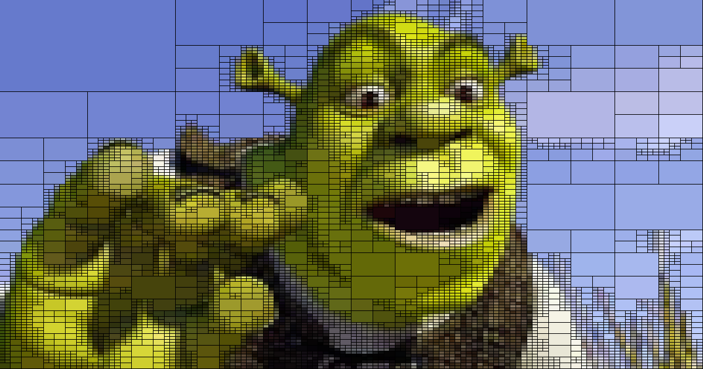

# Image Approximation Techniques

## Quadtree

The quadtree algorithm recursively partitions the image into 4 subregions until the local error falls below some threshold. Each subregion approximates the image by a constant color.

In this way we can reduce the geometric resolution of the image adaptively.

Reference

Result

