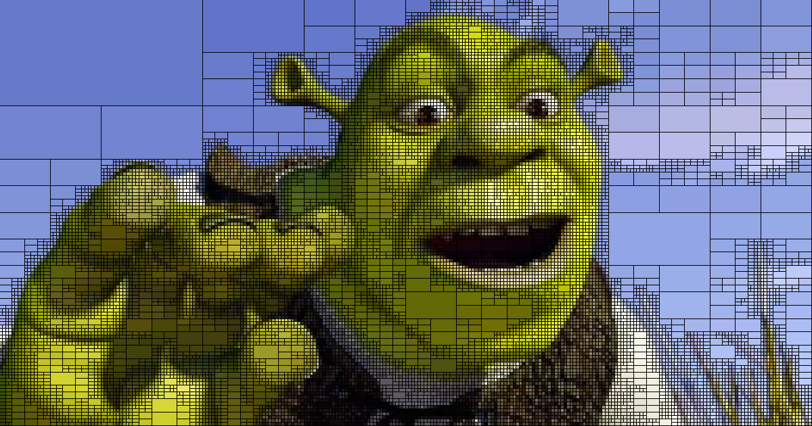
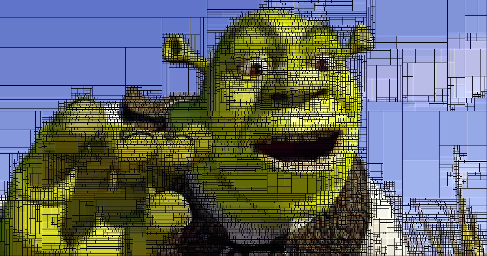
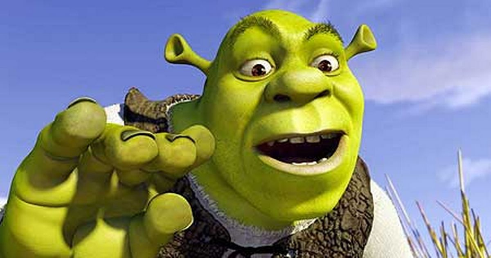
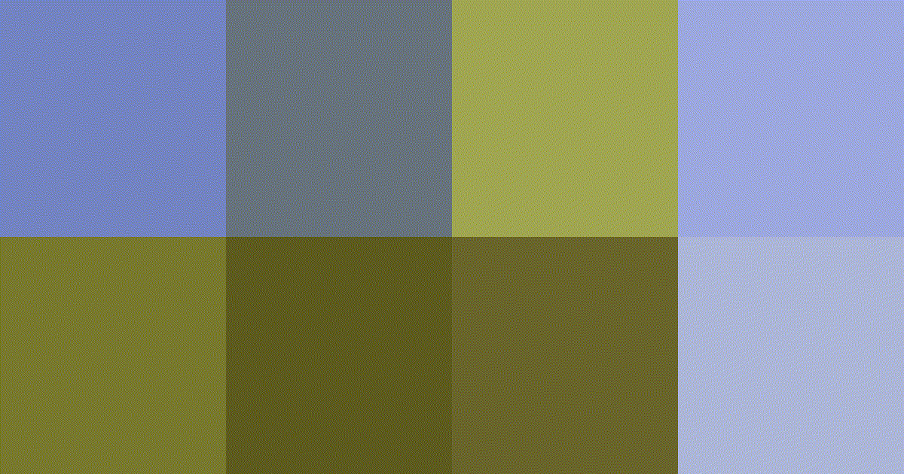
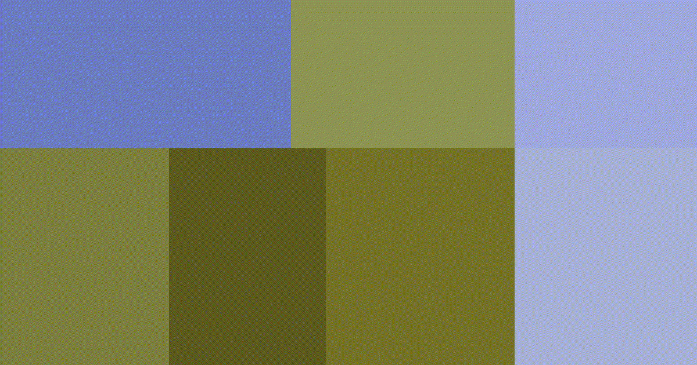

# Image Approximation Techniques

## Quadtree

The quadtree algorithm recursively partitions the image into subregions until the local error falls below some threshold or a maximum refinement is reached. Each subregion approximates the image by a constant color.

### Example

Two different subdivision methods are implemented. 

The regular quadtree algorithm splits into 4 equally sized children by default, and 2 if one dimension is below a threshold.

The adaptive variant does not always use the centroid for splitting but optimizes the choice of the pivot over multiple possible locations.

Reference

Result Regular

Result adaptive

#### Results based on decreasing cell size

